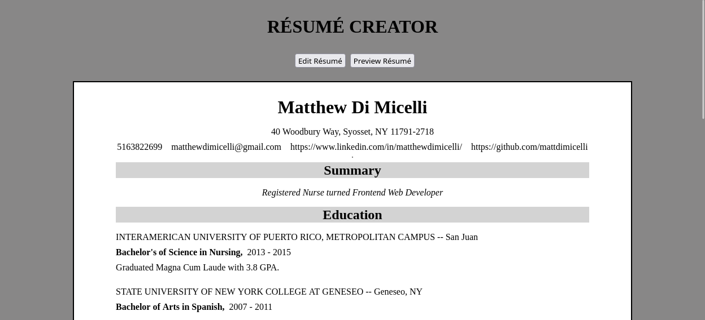

# Readme
# React Resume Creator WITH HOOKS!

## Overview

A refactored version of my first-ever React project.  All the class-based 
components were converted to functional components with hooks.  This app is a
resume creator that shows you the appearance of the resume as formatted to be printed while you are editting it.

### Challenge

The full requirements for the project from the Odin Project curriculum can be seen [here](https://www.theodinproject.com/paths/full-stack-javascript/courses/javascript/lessons/cv-application).  

### Screenshot

  

### Links

- [Live site](https://mattdimicelli.github.io/cv-project/) 
  - Note: the live site is actually the original, class-component version
- [Repo](https://github.com/mattdimicelli/cv_project_functional_components)

## My process

### Built with
- React, with functional components and hooks
- JSX
- create-react-app
- Uniqid library to create unique IDs for list rendering
- CSS

### What I learned

This was practice in regards to both class-based components and (stateful) 
functional components with hooks, since I was converting from one to the other.
See the original project [here](https://github.com/mattdimicelli/cv-project) for 
a much more in-depth description about what I learned.  

